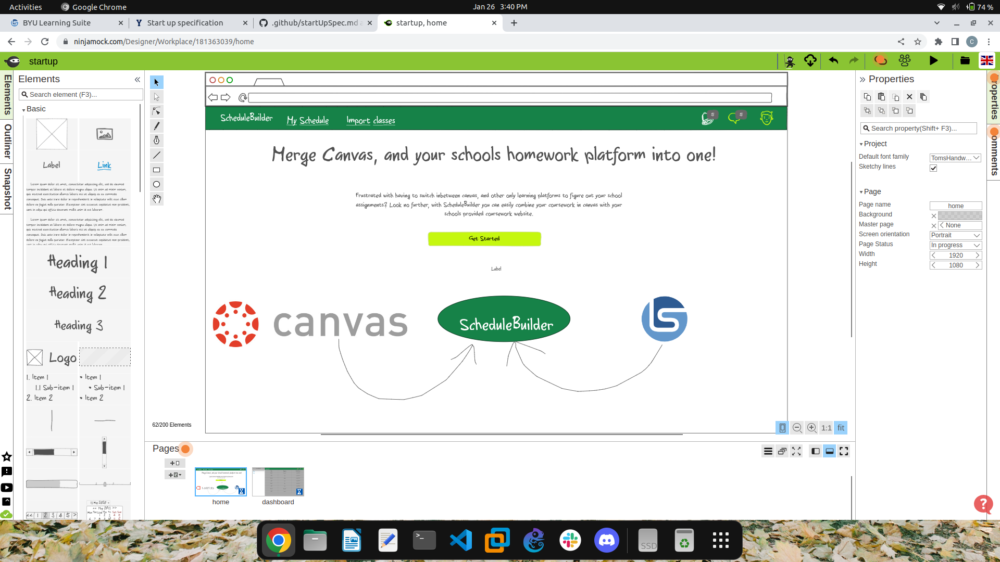
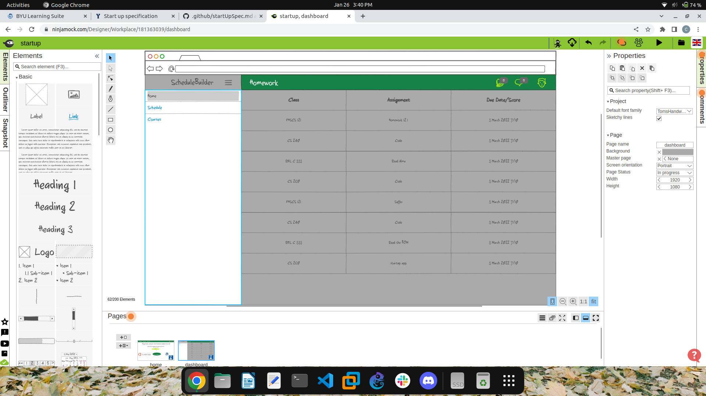
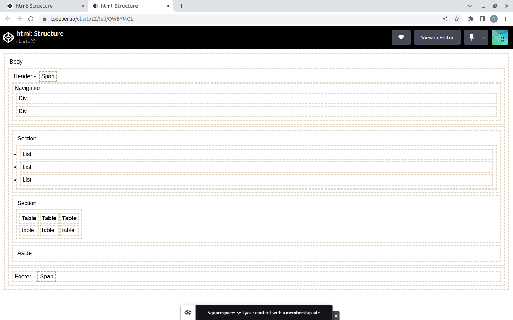

# startup
Caleb Barton
<br>
CS 260 
<br>
BYU Winter Semester 2023
<br>
repo for startup website
<br>
I have never done web development before, so don't make too much fun of me. 
* Creating a merge issue

## What did I learn?
I need to spend more time with GitHub. I am familiar with it, but I think that as I make commits more often
I will be quicker at using it. It took me a while to figure out how to resolve the merge issue (that's why we
have stack overflow). I am going to start using it for more than just the coding I do in this class, but also
for my other classes that I am in right now. 

## Startup
For my startup application I want to create an app that merges learningsuite with canvas. These are both great learning tools, but I have always been annoyed with having to use both. I wish we could use one or the other. So that is where I got my idea to create my own learning dashboard that merges the two using canvas' API, and for BYU's I guess copy and paste of the prioritzer list will have to due. Unless learning suite has an API I can use. It will have account creation, the basic CRUD functions(CREATE, READ, UPDATE, DELETE), API integration, database storage, and a mobile version. 

## Elevator Pitch
Have you ever been annoyed with having to use learningsuite alongside with canvas? You just want all of your
courses to be in one spot? Look no further, with ScheduleBuilder you can easily combine your coursework materials from learningsuite with those from canvas in one easy to use application!




## EC2
It's crazy how many web servers are out there.
How do routes dynamically assign a path to its 
destination?

## Route 53
hostname is schedulebuilder.click AWS can be 
buggy, make sure you clear browsing data to ensure everything is up. 

## HTTPS, TLS, and certificates
Caddy then either serves up the requested static files (gateway) or routes the request to another 
web service(reverse proxy)

## HTML Introduction 
### Common elements

Modern HTML contains over 100 different elements. Here is a short list of HTML elements that you will commonly see.

| element   | meaning                                                                |
| --------- | ---------------------------------------------------------------------- |
| `html`    | The page container                                                     |
| `head`    | Header information                                                     |
| `title`   | Title of the page                                                      |
| `meta`    | Metadata for the page such as character set or viewport settings       |
| `script`  | JavaScript reference. Either a external reference, or inline           |
| `include` | External content reference                                             |
| `body`    | The entire content body of the page                                    |
| `header`  | Header of the main content                                             |
| `footer`  | Footer of the main content                                             |
| `nav`     | Navigational inputs                                                    |
| `main`    | Main content of the page                                               |
| `section` | A section of the main content                                          |
| `aside`   | Aside content from the main content                                    |
| `div`     | A block division of content                                            |
| `span`    | An inline span of content                                              |
| `h<1-9>`  | Text heading. From h1, the highest level, down to h9, the lowest level |
| `p`       | A paragraph of text                                                    |
| `b`       | Bring attention                                                        |
| `table`   | Table                                                                  |
| `tr`      | Table row                                                              |
| `th`      | Table header                                                           |
| `td`      | Table data                                                             |
| `ol,ul`   | Ordered or unordered list                                              |
| `li`      | List item                                                              |
| `a`       | Anchor the text to a hyperlink                                         |
| `img`     | Graphical image reference                                              |
| `dialog`  | Interactive component such as a confirmation                           |
| `form`    | A collection of user input                                             |
| `input`   | User input field                                                       |
| `audio`   | Audio content                                                          |
| `video`   | Video content                                                          |
| `svg`     | Scalable vector graphic content                                        |
| `iframe`  | Inline frame of another HTML page                                      |

## Comments

You can include comments in your HTML files by starting the comment with `<!--` and ending it with `-->`. Any text withing a comment block will be completely ignored when the browser renders it.

```html
<!-- commented text -->
```

### Special characters

HTML uses several reserved characters for defining its file format. If you want to use those characters in your content then you need to escape them using the `entity` syntax. For example, to display a less than symbol (`<`) you would instead use the less than entity (`&lt;`). You can also use the entity syntax to represent any unicode character.

| Character | Entity      |
| --------- | ----------- |
| &amp;     | `&amp;`     |
| <         | `&lt;`      |
| >         | `&gt;`      |
| "         | `&quot;`    |
| '         | `&apos;`    |
| &#128512; | `&#128512;` |

## HTML Structure Elements
This will help you to remember how each element is layed out physically. 


## HTML Simon
* ./deployFiles.sh -k <keyfile> -h <yourdomain> -s simon
* I need to review the path tag better and how it works for SVGs
  I understand that M moves the cursor to a certain point, and Q 
  draws curves, but I don't understand how the coordinate system
  works. It doesn't seem as simple as an x,y coordinate system
* Remember organizational tags like main, header, div, span, etc. 
* Writing comments out is super helpful for code organization, 
  and overall thought process. 

## The box model

CSS defines everything as boxes. When you apply styles, you are applying them to a region of the display that is a rectangular box. Within an element's box there are several internal boxes. The innermost box holds the element's content. This is where things like the text or image of an element is displayed. Next comes the padding. The padding will inherit things like the background color. After padding is the border, which has properties like color, thickness and line style. The final box is the margin. The margin is considered external to the actual styling of the box and therefore only represents whitespace. It is important to understand each of these boxes so that you can achieve the desired visual result by applying the proper CSS declaration.


By default, the width and height of an element is defined by the width and height of the content box. You can change the `box-sizing` CSS property from the default value of `content-box` to `border-box` in order to redefine the width and height to also include the padding and the border. This often makes it easier to style elements when their visual size matches their actual size.
  
| Value  | Meaning                                                                                                                      |
| ------ | ---------------------------------------------------------------------------------------------------------------------------- |
| none   | Don't display this element. The element still exists, but the browser will not render it.                                    |
| block  | Display this element with a width that fills its parent element. A `p` or `div` element have block display by default.       |
| inline | Display this element with a width that is only as big as its content. A `b` or `span` element have block display by default. |
| flex   | Display this element's children in a flexible orientation.                                                                   |
| grid   | Display this element's children in a grid orientation.                                                                       |

## Simon CSS lessons learned
* Always use a CSS framework, it makes deciding colors so much easier
* Learn as many frameworks as you can, they are so cool

## Start HTML & CSS lessons learned
  * Bootstrap is awesome, it makes the CSS go by a lot quicker. You can waste a lot of time messing with CSS
  * Some functionalities of bootstrap require a script. Make sure you import it at the body of your html pages 
  right before the closing body tag
  * I need to spend more time messing with the display CSS rules, and position rules.
  * Organization and planning is key. Without them your development process will be one big headache. 

## JavaScript DOM Lessons Learned
* Make sure you really plan out your code and think it in your head before you start implementing it. 
* Visualize the end result
* MDN docs are your best friend
* Don't overcomplicate the code

## Async Await Lessons Learned
* Even though using promises are easier for me to understand Async and Await are used more frequently
* This page is extremely helpful: https://rapidapi.com/guides/fetch-api-async-await?utm_source=google&utm_medium=cpc&utm_campaign=DSA&utm_term=_&gclid=Cj0KCQiA6fafBhC1ARIsAIJjL8mNvyac3L6ZUmFbOhbPQaEQQECfyjDNZbeZTDiilrYTRvTKYIxXfN0aAiMhEALw_wcB

## Simon Javascript Lesson Learned
* Scripts need to be placed at the bottom of the html page to load the html before the JavaScript
is run. 
* Wherever a script tag is placed is when it will 
be ran. That way you can run methods in the order
you specify. 
* ```Array.from()``` method according to MDN web docs creates a new, shallow-copied ```Array``` instance from 
an iterable or array-like object. 
```
console.log(Array.from([1,2,3], x => x + x));
// Expected output: Array [2,4,6]
```

## Startup Javascript Lesson Learned
* Plan out how you will organize your code and what operations you will need. Objects need to be thought
out in detail, explaining how they will be manipulated, stored, etc. This will save you the headache.

## URL Lesson Things to Remember 
| Part        | Example                              | Meaning                                                                                                                                                                                                                                                                             |
| ----------- | ------------------------------------ | ----------------------------------------------------------------------------------------------------------------------------------------------------------------------------------------------------------------------------------------------------------------------------------- |
| Scheme      | https                                | The protocol required to ask for the resource. For web applications, this is usually HTTPS. But it could be any internet protocol such as FTP or MAILTO.                                                                                                                            |
| Domain name | byu.edu                              | The domain name that owns the resource represented by the URL.                                                                                                                                                                                                                      |
| Port        | 3000                                 | The port specifies the numbered network port used to connect to the domain server. Lower number ports are reserved for common internet protocols, higher number ports can be used for any purpose. The default port is 80 if the scheme is HTTP, or 443 if the scheme is HTTPS.     |
| Path        | /school/byu/user/8014                | The path to the resource on the domain. The resource does not have to physically be located on the file system with this path. It can be a logical path representing endpoint parameters, a database table, or an object schema.                                                    |
| Parameters  | filter=names&highlight=intro,summary | The parameters represent a list of key value pairs. Usually it provides additional qualifiers on the resource represented by the path. This might be a filter on the returned resource or how to highlight the resource. The parameters are also sometimes called the query string. |
| Anchor      | summary                              | The anchor usually represents an sub-location in the resource. For HTML pages this represents a request for the browser to automatically scroll to the element with an ID that matches the anchor. The anchor is also sometimes called the hash, or fragment ID. 

## Ports Lesson Things to Remember
| Port | Protocol                                                                                           |
| ---- | -------------------------------------------------------------------------------------------------- |
| 20   | File Transfer Protocol (FTP) for data transfer                                                     |
| 22   | Secure Shell (SSH) for connecting to remote devices                                                |
| 25   | Simple Mail Transfer Protocol (SMTP) for sending email                                             |
| 53   | Domain Name System (DNS) for looking up IP addresses                                               |
| 80   | Hypertext Transfer Protocol (HTTP) for web requests                                                |
| 110  | Post Office Protocol (POP3) for retrieving email                                                   |
| 123  | Network Time Protocol (NTP) for managing time                                                      |
| 161  | Simple Network Management Protocol (SNMP) for managing network devices such as routers or printers |
| 194  | Internet Relay Chat (IRC) for chatting                                                             |
| 443  | HTTP Secure (HTTPS) for secure web requests                                                        |

## HTTP Lessons Learned
| Code | Text                                                                                 | Meaning                                                                                                                           |
| ---- | ------------------------------------------------------------------------------------ | --------------------------------------------------------------------------------------------------------------------------------- |
| 100  | Continue                                                                             | The service is working on the request                                                                                             |
| 200  | Success                                                                              | The requested resource was found and returned as appropriate.                                                                     |
| 201  | Created                                                                              | The request was successful and a new resource was created.                                                                        |
| 204  | No Content                                                                           | The request was successful but no resource is returned.                                                                           |
| 304  | Not Modified                                                                         | The cached version of the resource is still valid.                                                                                |
| 307  | Permanent redirect                                                                   | The resource is no longer at the requested location. The new location is specified in the response location header.               |
| 308  | Temporary redirect                                                                   | The resource is temporarily located at a different location. The temporary location is specified in the response location header. |
| 400  | Bad request                                                                          | The request was malformed or invalid.                                                                                             |
| 401  | Unauthorized                                                                         | The request did not provide a valid authentication token.                                                                         |
| 403  | Forbidden                                                                            | The provided authentication token is not authorized for the resource.                                                             |
| 404  | Not found                                                                            | An unknown resource was requested.                                                                                                |
| 408  | Request timeout                                                                      | The request takes too long.                                                                                                       |
| 409  | Conflict                                                                             | The provided resource represents an out of date version of the resource.                                                          |
| 418  | [I'm a teapot](https://en.wikipedia.org/wiki/Hyper_Text_Coffee_Pot_Control_Protocol) | The service refuses to brew coffee in a teapot.                                                                                   |
| 429  | Too many requests                                                                    | The client is making too many requests in too short of a time period.                                                             |
| 500  | Internal server error                                                                | The server failed to properly process the request.                                                                                |
| 503  | Service unavailable                                                                  | The server is temporarily down. The client should try again with an exponential back off.                                         |

| Verb    | Meaning                                                                                                                                                                                                                                                  |
| ------- | -------------------------------------------------------------------------------------------------------------------------------------------------------------------------------------------------------------------------------------------------------- |
| GET     | Get the requested resource. This can represent a request to get a single resource or a resource representing a list of resources.                                                                                                                        |
| POST    | Create a new resource. The body of the request contains the resource. The response should include a unique ID of the newly created resource.                                                                                                             |
| PUT     | Update a resource. Either the URL path, HTTP header, or body must contain the unique ID of the resource being updated. The body of the request should contain the updated resource. The body of the response may contain the resulting updated resource. |
| DELETE  | Delete a resource. Either the URL path or HTTP header must contain the unique ID of the resource to delete.                                                                                                                                              |
| OPTIONS | Get metadata about a resource. Usually only HTTP headers are returned. The resource itself is not returned.                                                                                                                                              |

# Simon Service Lessons Learned

## Defining routes

HTTP endpoints are implemented in Express by defining routes that call a function based upon an HTTP path. The Express app object supports all of the HTTP verbs as functions on the object. For example, if you want to have a route function that handles an HTTP GET request for the URL path `/store/provo` you would call the `get` method on the app.

```js
app.get('/store/provo', (req, res, next) => {
  res.send({ name: 'provo' });
});
```

The `get` function takes two parameters, a URL path matching pattern, and a callback function that is invoked when the pattern matches. The path matching parameter is used to match against the URL path of an incoming HTTP request.

The callback function has three parameters that represent the HTTP request object (`req`), the HTTP response object (`res`), and the `next` routing function that Express expects to be called if this routing function wants another function to generate a response.

The express app compares the routing function patterns in the order that they are added to the Express app object. So if you have two routing functions with patterns that both match, the first one that was added will be called and given the next matching function in the `next` parameter.

In our example above we hard coded the store name to be `provo`. A real store endpoint would allow any store name to be provided as a parameter in the path. Express supports path parameters by prefixing the parameter name with a colon (`:`). Express creates a map of path parameters and populates it with the matching values found in the URL path. You then reference the parameters using the `req.params` object. Using this pattern you can rewrite our getStore endpoint as follows.

```js
app.get('/store/:storeName', (req, res, next) => {
  res.send({ name: req.params.storeName });
});
```

If we run our JavaScript using node we can see the result when make an HTTP request using curl.

```sh
➜ curl localhost:8080/store/orem
{"name":"orem"}
```

If you wanted an endpoint that used the POST or DELETE HTTP verb then you just use the `post` or `delete` function on the Express app object.

The route path can also include a limited wildcard syntax or even full regular expressions in path pattern. Here are a couple route functions using different pattern syntax.

```js
// Wildcard - matches /store/x and /star/y
app.put('/st*/:storeName', (req, res) => res.send({ update: req.params.storeName }));

// Pure regular expression
app.delete(/\/store\/(.+)/, (req, res) => res.send({ delete: req.params[0] }));
```

Notice that in these examples the `next` parameter was omitted. Since we are not calling `next` we do not need to include it as a parameter. However, if you do not call next then no following middleware functions will be invoked for the request.

## Using middleware

The standard [Mediator/Middleware](https://www.patterns.dev/posts/mediator-pattern/) design pattern has two pieces: A mediator and middleware. Middleware represents componentized pieces of functionality. The mediator loads the middleware components and determines their order of execution. When a request comes to the mediator it then passes the request around to the middleware components. Following this pattern, Express is the mediator, and middleware functions are the middleware components.

Express comes with a standard set of middleware functions. These provide functionality like routing, authentication, CORS, sessions, serving static web files, cookies, and logging. Some middleware functions are provided by default, and other ones must be installed using NPM before you can use it. You can also write your own middleware functions and use them with Express.

A middleware function looks very similar to a routing function. That is because routing functions are also middleware functions. The only difference is that routing functions are only called if the associated pattern matches. Middleware functions are always called for every HTTP request unless a preceding middleware function does not call `next`. A middleware function has the following pattern:

```js
function middlewareName(req, res, next)
```

The middleware function parameters represent the HTTP request object (`req`), the HTTP response object (`res`), and the `next` middleware function to pass processing to. You should usually call the `next` function after completing processing so that the next middleware function can execute.


### Creating your own middleware

As an example of writing your own middleware, you can create a function that logs out the URL of the request and then passes on processing to the next middleware function.

```js
app.use((req, res, next) => {
  console.log(req.originalUrl);
  next();
});
```

Remember that the order that you add your middleware to the Express app object controls the order that the middleware functions are called. Any middleware that does not call the next function after doing its processing, stops the middleware chain from continuing.

### Builtin middleware

In addition to creating your own middleware functions, you can use a built-in middleware function. Here is an example of using the `static` middleware function. This middleware responds with static files, found in a given directory, that match the request URL.

```js
app.use(express.static('public'));
```

Now if you create a subdirectory in your project directory and name it `public` you can serve up any static content that you would like. For example, you could create an `index.html` file that is the default content for your web service. Then when you call your web service without any path the index.html file will be returned.

### Third party middleware

You can also use third party middleware functions by using NPM to install the package and including the package in your JavaScript with the `require` function. The following uses the `cookie-parser` package to simplify the generation and access of cookies.

```sh
➜ npm install cookie-parser
```

```js
const cookieParser = require('cookie-parser');

app.use(cookieParser());

app.post('/cookie/:name/:value', (req, res, next) => {
  res.cookie(req.params.name, req.params.value);
  res.send({ cookie: `${req.params.name}:${req.params.value}` });
});

app.get('/cookie', (req, res, next) => {
  res.send({ cookie: req.cookies });
});
```

It is common for middleware functions to add fields and functions to the `req` and `res` object so that other middleware can access the functionality they provide. You see this happening when the cookie-parser middleware adds the `req.cookies` object for reading cookies, and also adds the `res.cookie` function in order to make it easy to add a cookie to a response.

## Error handling middleware

You can also add middleware for handling errors that occur. Error middleware looks similar to other middleware functions, but it takes an additional `err` parameter that contains the error.

```js
function errorMiddlewareName(err, req, res, next)
```

If you wanted to add a simple error handler for anything that might go wrong while process HTTP requests you could add the following.

```js
app.use(function (err, req, res, next) {
  res.status(500).send({ type: err.name, message: err.message });
});
```

We can test that our error middleware is getting used by adding a new endpoint that generates an error.

```js
app.get('/error', (req, res, next) => {
  throw new Error('Trouble in river city');
});
```

Now if we use curl to call our error endpoint we can see that the response comes from the error middleware.

```sh
➜ curl localhost:8080/error
{"type":"Error","message":"Trouble in river city"}
```

## Putting it all together

Here is a full example of our web service built using Express.

```js
const express = require('express');
const cookieParser = require('cookie-parser');
const app = express();

// Third party middleware - Cookies
app.use(cookieParser());

app.post('/cookie/:name/:value', (req, res, next) => {
  res.cookie(req.params.name, req.params.value);
  res.send({ cookie: `${req.params.name}:${req.params.value}` });
});

app.get('/cookie', (req, res, next) => {
  res.send({ cookie: req.cookies });
});

// Creating your own middleware - logging
app.use((req, res, next) => {
  console.log(req.originalUrl);
  next();
});

// Built in middleware - Static file hosting
app.use(express.static('public'));

// Routing middleware
app.get('/store/:storeName', (req, res) => {
  res.send({ name: req.params.storeName });
});

app.put('/st*/:storeName', (req, res) => res.send({ update: req.params.storeName }));

app.delete(/\/store\/(.+)/, (req, res) => res.send({ delete: req.params[0] }));

// Error middleware
app.get('/error', (req, res, next) => {
  throw new Error('Trouble in river city');
});

app.use(function (err, req, res, next) {
  res.status(500).send({ type: err.name, message: err.message });
});

// Listening to a network port
const port = 8080;
app.listen(port, function () {
  console.log(`Listening on port ${port}`);
});
```

# Simon DB Lessons Learned 
This is how a simple POST request to mongoDB was made using ```fetch();```
```
const userName = this.getPlayerName();
const date = new Date().toLocaleDateString();
const newScore = { name: userName, score: score, date: date };

try {
  const response = await fetch('/api/score', {
    method: 'POST',
    headers: { 'content-type': 'application/json' },
    body: JSON.stringify(newScore),
  });

  // Store what the service gave us as the high scores
  const scores = await response.json();
  localStorage.setItem('scores', JSON.stringify(scores));
} catch {
  // If there was an error then just track scores locally
  this.updateScoresLocal(newScore);
}
```
## Environment Variables
* For whatever reason, the application wouldn't pull my environment variables from /etc/environment. What I had to do was include this line 
of code in my ```database.js``` file to reach out to that file. First I
had to install ```npm install dotenv --save```. 

* ```require('dotenv').config({ path: '/etc/environment'});```

## Module Exports
* I was curious as to what this line of code did: ```module.exports = {addScore, getHighScores};``` Upon further research I found this from educative.io: "Module exports are the instructions that tell Node.js which bits of code (functions, objects, strings, etc.) to export from a given file so that other files are allowed to access the exported code."

# Simon Login Lessons Learned 
* An Anonymous Function in JavaScript is simply a function that doesn't have a name.
* ```?``` can mean many different things, but in this lab it is used to return an undefined attribute of an object, without throwing the error that would typically occur at runtime. 
* Bootstrap Modals are light-weight multipurpose JavaScript popups that are customizable. Like the login one on this example. 

* The service endpoints are contained in `index.js`. The endpoints include `authCreate`, `authLogin`, `authLogout`, and `userGet`. These all work with the database to store and get credentials and update the authorization cookie.

* A new Express router, `secureApiRouter` wraps the existing router to add a middleware function that verifies that the authorization cookie is valid before passing the request to endpoints that require authorization. That makes it easy to create secure endpoints by just registering them with `secureApiRouter`.